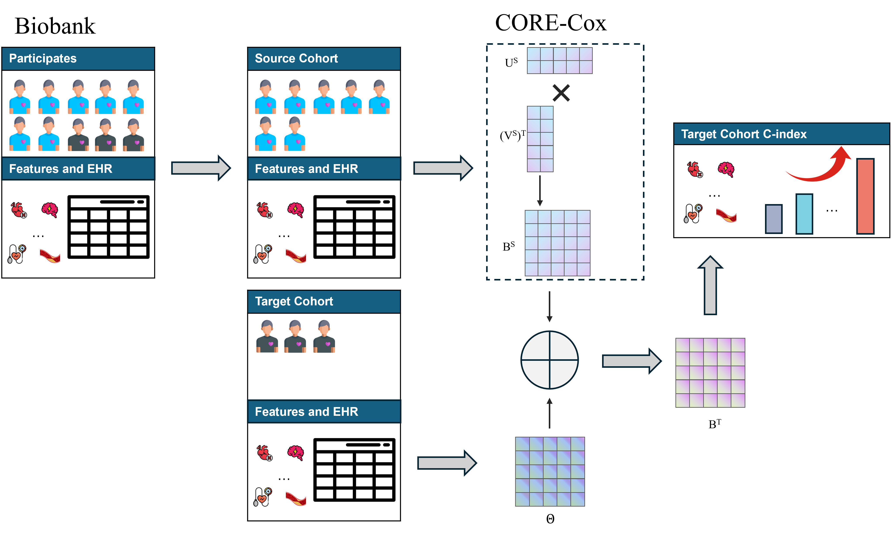

# CORE-Cox

<p align="center"><strong>Structured transfer learning for multi-outcome survival analysis in data-sparse cohorts</strong></p>

<p align="center">
  <a href="https://arxiv.org/abs/2605.15633"></a>
  <a href="LICENSE"></a>
</p>

CORE-Cox (**CO**hort-shared **R**ank-r**E**duced Cox) transfers survival-risk information from a large source cohort to a smaller target cohort. It learns patterns shared across related outcomes, then adapts them through regularized residual correction.

> Paper: [Structured Transfer Learning for Survival Risk Stratification in Data-Sparse Clinical Cohorts](https://arxiv.org/abs/2605.15633)

## Contents

- [Overview](#overview)
- [Method](#method)
- [Installation](#installation)
- [Input data](#input-data)
- [Quick start](#quick-start)
- [Outputs](#outputs)
- [Citation](#citation)
- [Limitations](#limitations)

## Overview

Target-only survival models can be unstable in cohorts with few participants or outcome events. Direct transfer can also fail when risk-factor effects differ between populations. CORE-Cox balances the two:

1. **Share across outcomes:** fit a low-rank, multi-task Cox model in the source cohort.
2. **Adapt across cohorts:** estimate a regularized target-specific correction.

The implementation supports multiple outcomes, outcome-specific missingness, right censoring, source-based feature standardization, risk-score prediction, and coefficient inspection.

## Method

For \(p\) predictors, \(K\) outcomes, and rank \(r\):

$$
B_{\mathrm{source}} = UV^\top,
\qquad
B_{\mathrm{target}} = B_{\mathrm{source}} + \Theta.
$$

\(U\) contains shared predictor patterns, \(V\) contains outcome-specific loadings, and an \(L_2\) penalty on \(\Theta\) controls target-cohort deviation.

<p align="center">
  
</p>

<p align="center"><em>Overview of the CORE-Cox framework.</em></p>

See the [paper](https://arxiv.org/abs/2605.15633) for the full formulation, study design, and clinical-cohort results.

## Installation

```bash
pip install -r requirements.txt
```

The first fit may take longer because Numba compiles the numerical Cox routines.

## Input data

Source and target cohorts are pandas DataFrames with one participant per row. They require the same numeric predictors in the same order, plus an event/time pair per outcome:

- event: `1` for an observed event and `0` for censoring;
- time: positive follow-up time.

| age | sex | biomarker_1 | disease_a_event | disease_a_time |
|---:|---:|---:|---:|---:|
| 61 | 0 | 2.31 | 1 | 4.2 |
| 54 | 1 | 1.87 | 0 | 6.5 |

```python
diseases = {
    "disease_a_event": "disease_a_time",
    "disease_b_event": "disease_b_time",
}
```

Rows with missing predictors are removed. Missing event/time values are handled separately for each outcome.

## Quick start

```python
import pandas as pd
from corecox import CoreCoxModel, SourceCoxModel, prepare_survival_data

source_df = pd.read_csv("source.csv")
target_df = pd.read_csv("target.csv")
diseases = {
    "disease_a_event": "disease_a_time",
    "disease_b_event": "disease_b_time",
}
source_data, target_data = prepare_survival_data(source_df, target_df, diseases)

source_model = SourceCoxModel(
    rank=2, lambda_rank=0.01, max_iter=300,
    standardize=True, verbose=False,
)
source_model.fit(source_data)

model = CoreCoxModel(
    source_lr_model=source_model,
    lambda_theta=0.01,
    optimization_method="lbfgs",
    max_iter=1000,
    verbose=False,
)
model.fit(target_data)

X_new = target_df[source_data.predictor_vars].to_numpy()
risk_scores = model.predict_risk_scores(X_new)
target_coefficients = model.get_original_beta_matrix()
residuals = model.get_residual_matrix()
```

See [`example_usage.py`](example_usage.py) for a runnable template.

## Outputs

| Method | Description |
|---|---|
| `predict_risk_scores(X)` | Outcome-specific scores; higher means higher relative hazard. |
| `get_original_beta_matrix()` | Target coefficients in the original predictor units. |
| `get_target_coefficients()` | Target coefficients on the standardized scale. |
| `get_source_coefficients()` | Source coefficients on the standardized scale. |
| `get_residual_matrix()` | Target-specific correction \(\Theta\). |

Key tuning parameters are `rank`, `lambda_rank`, and `lambda_theta`. Select them using validation data or nested cross-validation appropriate to the study design.

## Citation

If you use CORE-Cox in your research, please cite:

```bibtex
@article{yu2026structured,
  title   = {Structured Transfer Learning for Survival Risk Stratification in Data-Sparse Clinical Cohorts},
  author  = {Yu, Junhan and Chen, Yurui and Delgado-SanMartin, Juan and Wang, Dennis and Pan, Hong and Zhou, Doudou},
  journal = {arXiv preprint arXiv:2605.15633},
  year    = {2026},
  url     = {https://arxiv.org/abs/2605.15633}
}
```

GitHub citation metadata is available in [`CITATION.cff`](CITATION.cff).

## Limitations

This is a research implementation and is not validated for clinical decision-making. Target outputs are relative-risk scores; calibrated absolute-risk prediction requires a target-cohort baseline hazard and additional validation.

## License

Released under the [MIT License](LICENSE).
